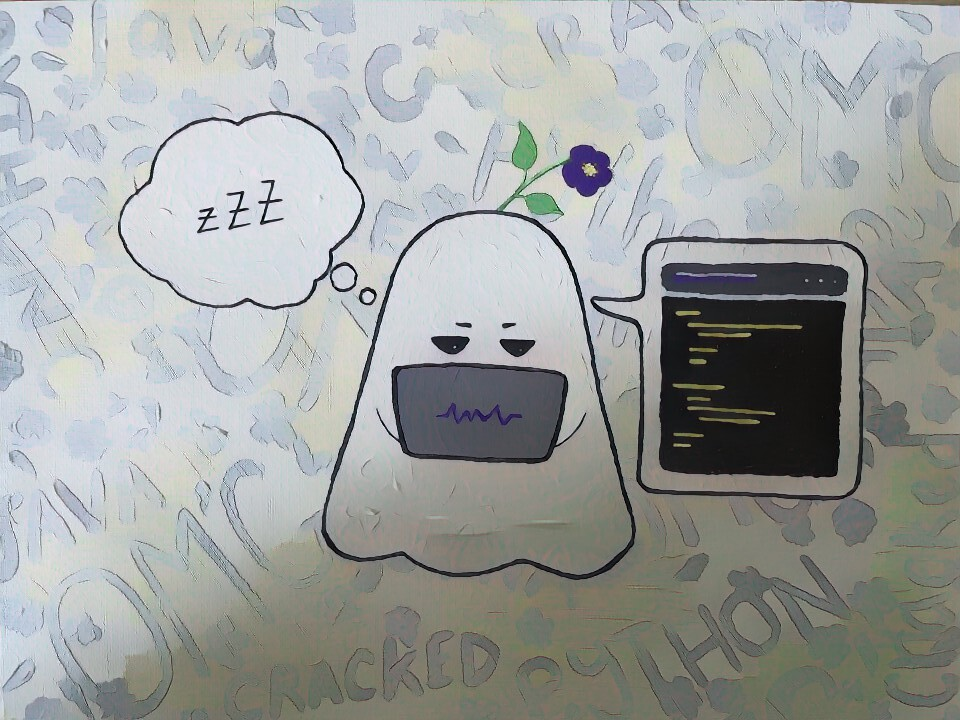

<h1 align="center">Hi 👋, I'm David</h1>

<h3 align="left">A diligent and motivated Computer Science/Maths student, with enthusiastic and strong foundation in math, programming skill and
DSA related knowledge. Seeking for leverage my development skill, with focus on developing my collaboration, communication and
creativity skill.</h3>

<h3> Here's some fun facts about me: </h3>

- 🔭 I’m currently working on a React Projects, leetcode analyzer. 
- 🌱 I'm a second year Computer Science Student at UNSW.
- 💬 One of my hobby is Competitive Programming.
- 🚦 I have Knight Badge on leetcode site. 

Projects

  
  <!---
  | Command | Description |
| --- | --- |
| [Vectors of Locally Aggregated Concepts](https://github.com/MaartenGr/VLAC) |  |
| ... | ... |
  --->
  
| Project | Tags |
| --- | --- |
| [**Online Chatting App**, BACK-END](https://github.com/Dammshine/NodeJs-Backend-Project) |       |
| [**Pedestrian Detection on Self-automated Cars**](https://github.com/tunedin-ctrl/Comp9444-project) |       |

  

